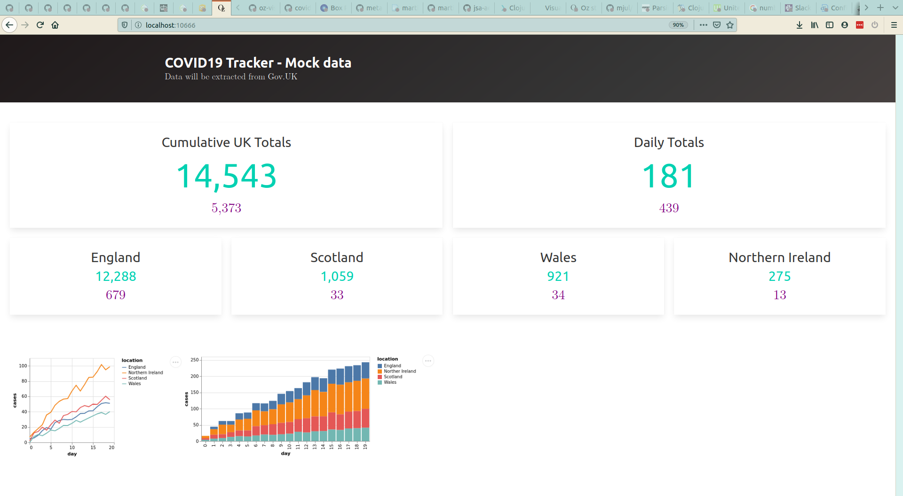

# covid19-dashboard
A dashboard created with [Oz](https://github.com/metasoarous/oz) as an example of data science visualization.



## Installation
Clone https://github.com/practicalli/covid19-dashboard.

## Usage
From the command line using [Clojure CLI tools](https://clojure.org/guides/getting_started):
```shell
clojure -m practicalli.covid19-dashboard
```

A browser window will open and display the dashboard, similar to the screenshot above.

To run in a REPL, evaluate the `practicalli.covid19-dashboard` namespace, then evaluate a call to the `-main` function, e.g. `(-main)`

Read the `src/practicalli/design_journal.clj` file to follow the evolution of the design of the application.


## Updating the data
The latest covid cases and deaths data is available from https://coronavirus.data.gov.uk/

The data is typically 1 day behind and not updated on Saturday and Sunday.

Save new cases files to the `resources/data-sets/uk-coronavirus-cases.csv`

> NOTE: only the geojson uses the latest data.  The headline figures, line plot and bar chart use data from th 14th April.  This will be updated in the next version of the project.


## Deployment
The project is not regarded production ready, however, should you wish to deploy use the following Clojure CLI tools commands.

Build an uberjar:

    $ clojure -A:uberjar

Run that uberjar:

    $ java -jar covid19-dashboard.jar


## License

Copyright © 2020 Practicalli

Distributed under the Creative Commons Attribution Share-Alike 4.0 International
